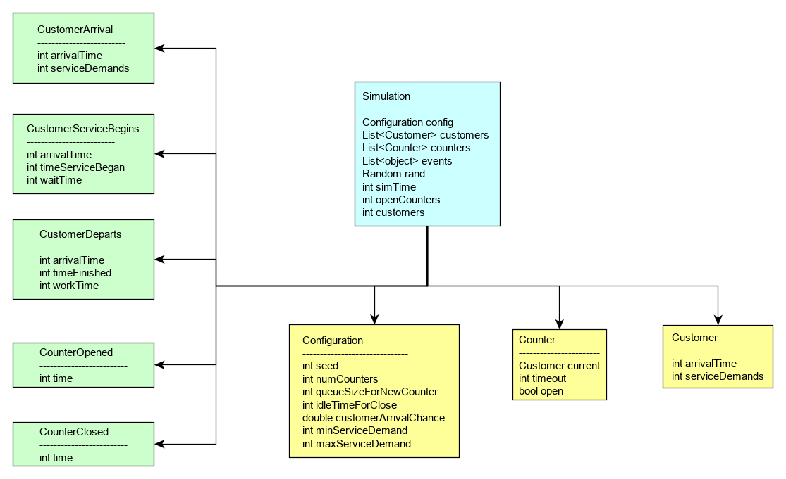
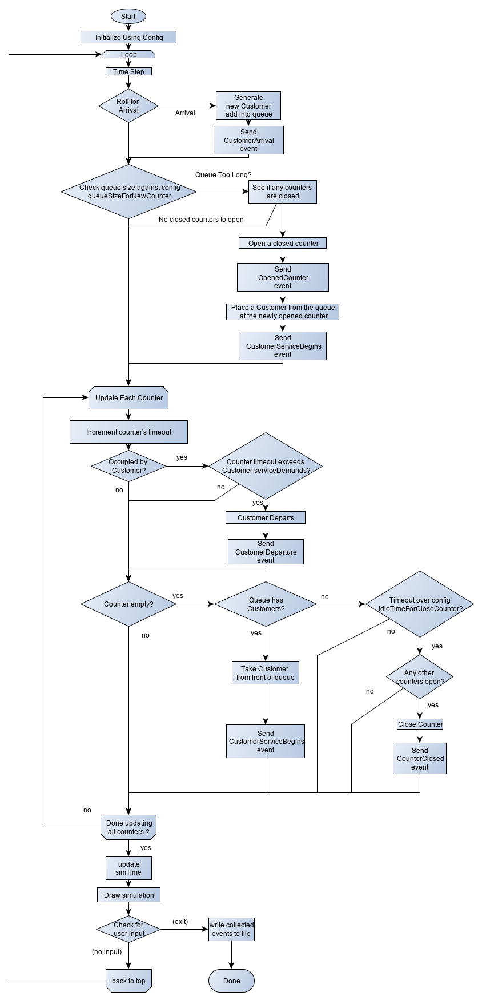

# A.
Entities to consider:
- Simulation
	- Customers
	- Counters
	- Queue(s)
- Attributes (Configuration)
	- Random Seed
	- Number of counters
	- Maximum Queue Size for a new counter to open
	- Idle Time For Close
	- Customer Arrival Rate
	- Service Demand Range.

Class Chart:  

# B. 
Flowchart:  

