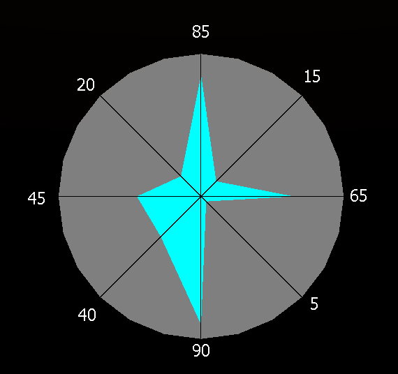

# 1. Slide 6-39, Ex 6.1
- Perform Ex 6.1, including normalization of data. 
- What type of normalization should you perform? Why?
- Use a plot of the data to show relationships.
	- What does the plot tell you about likely clusters?
- Perform spanning tree algorithm step by step and determine final clusters.

Data:
```
Program Name	Function	CPU Time		IOs
TKB				Linker			  14	   2735
MAC				Assembler		  13		253
COBOL			Compiler		   8		 27
BASIC			Compiler		   6		 27
PASCAL			Compiler		   6		 12
EDT				Text Editor		   4		 91
SOS				Text Editor		   1		 33
```

I would normalize using a log scale applied to the IOs metric. 
I see that IOs are more varied, but I also know that linkers and assemblers have quite high IOs as per the way those programs are implemented. I also see that programs that are fairly 'close' even with the outliers should not be spread so far from each other. I feel that a log scale is a good choice for transforming the number of IOs before clustering.

Normalized Data:
```
Program Name	Function	CPU Time		Log2(IOs)
TKB				Linker			  14		   11.417
MAC				Assembler		  13			7.983
COBOL			Compiler		   8			4.755
BASIC			Compiler		   6			4.755
PASCAL			Compiler		   6			3.585
EDT				Text Editor		   4			6.508
SOS				Text Editor		   1			5.044
```
Scatter plot:  


- I will likely start by clustering BASIC and PASCAL, as they are close
- I anticipate MAC and TKB being a likely cluster.
- I anticipate SOS and EDT being a likely cluster.
- I anticipate COBOL being added to BASIC and PASCAL.
- I think it is possible that EDT/SOS will cluster with BASIC/PASCAL/COBOL, but I could decide to draw the limit on the intra-cluster distance before that point.

I wrote some quick code to run a min-spanning-tree operation over the given data.

From the merge steps in the output, I derived this dendogram.


I would stop this after step 4, as there would be 3  clusters:
- `EDT`, `SOS`
- `COBOL`, `PASCAL`, `BASIC`
- `TKB`, `MAC`

Drawing those clusters on the scatter plot:


# 2. Slide 10-24, Ex 10.2
(15pts)

3 Resources, `{ A, B, C }`  
Following Table:
```
A	B	C	Time Used
0	0	0	25%
0	0	1	10%
0	1	0	20%
0	1	1	5%
1	0	0	5%
1	0	1	15%
1	1	0	5%
1	1	1	15%
```


# 3. Kiviat Graph
The measured values of eight performance metrics on 10.2 are:  
`(85, 15, 65, 5, 90, 40, 45, 20)`  
Draw the Kivat Graph and compute the figure of merit.



```
Metrics ordered (Good, Bad, Good, Bad) etc...
FOM = Sqrt( 1/2n * Sum(i 0 to n, (x[2i-1] + x[2i+1]) * (100-x[2i]) ) )

n for above = 4
FOM =  Sqrt( 1/8 * ((85+65) * (100-15) 
			+(65+90) * (100-5)
			+(90+45) * (100-40)
			+(45+85) * (100-20)) ) = 75.08

```