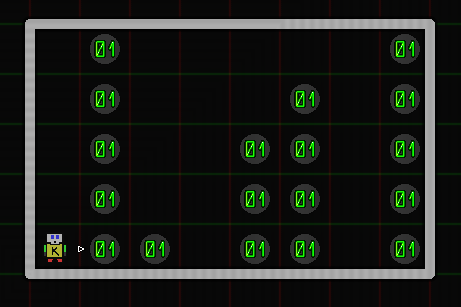
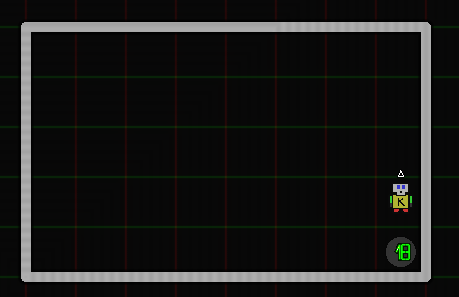

# Karel.js The Robot
# Beeper Towers

Consider the following world.

Write a program as follows:
1. Karel takes all of the 'towers' of beepers
2. Karel places all of the beepers in the bottom-left corner
3. Karel moves off of the stack so the count is visible.

Such that the world finishes in this state:

The solution should also work for the following world,  
or any similar world of any size.  

The key things about these worlds is that:
1. There is some rectangular region (room), boxed in completely by walls.
2. Karel always starts in the bottom left, facing right.
3. Beeper 'towers' always start from the bottom
4. Beeper 'towers' never have any gaps
5. Beeper 'towers' may also be on the first and last 'columns' of the room

### Tips:
- As always, break the problem down into smaller parts.
	- Solve the smaller parts one at a time.
	- Combine the smaller solutions into a bigger solution
	
- What does it take for karel to 'detect' if he's standing on a tower?
	- How does karel know when he's done taking a tower?
	
- What construct needs to be used to get Karel to repeat some task.

- Be sure to **remove all of karel's beepers** before sending him on his way 