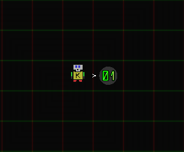
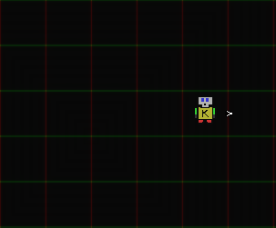
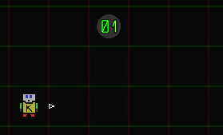
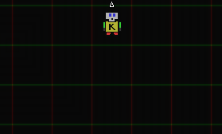
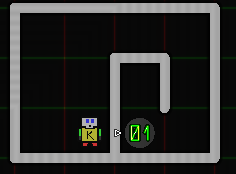
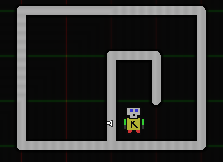

# Karel.js The Robot
# Intro Programs

This is a walkthrough of karel's basic features, with example worlds and sample code.  
A note about comments before we start, for those beginners who haven't seen code before:
```js
// This is a 'line comment'.
// Everything on the rest of the line after the '//' is ignored, 
// (the computer won't try to run comments)
// Allowing us to write english descriptions of code.

/* This is a 'block comment'.
everything between the delimiters is ignored,
even if it spans multiple lines.

Block comments can be useful for including really large blocks of text to describe code.
*/
```

## Walk, Grab, Walk.
Your first karel programs will be very simple.  
Click the `Empty World` button to reset karel's world.  
Click to place down a beeper in the cell to his right like so:  


Select the text in the JavaScript Entry box and clear it  
(`ctrl-a` or `cmd-a` to select all, then `backspace`/`delete`.)  (Clear Script button Not Yet Implemented.)  
Type the following program in:
```js
step();
takeBeeper();
step();
```
When you click the `run` button, Karel will execute the instructions, one at a time.  
He will take a step in the direction he is facing when he runs the `step()` command,  
he will grab the beeper on the ground when he runs the `takeBeeper()` command,  
and finally, he will take another step forward when he runs the final `step()` command.

The resulting world will look like this (from the same perspective):  


## Getting Turnt
The next program will look at having karel grab a beeper that isn't in line with himself.

Consider the following world:  


In order to get this beepe,r karel needs to:
1. line himself up with it vertically
2. to face it
3. step forward to be on top of it
4. finally grab it

The code to do this would be:
```js
step();
step();
// Karel is now lined up with the beeper, vertically

// Change the way karel is facing
turnLeft(); 

step();
step();
// Now karel is on the beeper...
takeBeeper();
```

Karel should finish this program as follows:  


### Try Yourself:
- Place a beeper close to karel, but in a different location. Write a program to navigate karel to the button.

## Walled In
The next program will look at having karel avoid walls.

Consider the following world:  


(Walls can be created/destroyed by clicking near the gridlines) in the editor window.)

Even though karel is only one cell away from the beeper, he can't grab the beeper with the same program as the first example.  
Karel will need to walk around the walls in order to grab the beeper.

A solution might be:
```js
turnLeft();
step(); 
step();
// Turn right by turning left 3 times:
turnLeft();
turnLeft();
turnLeft();
step();
step();
// Turn right by turning left 3 times:
turnLeft();
turnLeft();
turnLeft();
step();
step();
// Turn right by turning left 3 times:
turnLeft();
turnLeft();
turnLeft();
step();

// Finally, on the beeper!
takeBeeper();
```
Karel would finish this program as follows:  


Karel is able to navigate anywhere (his world is effectively infinite) by using only `step()` and `turnLeft()`.

### Try Yourself:
- Draw a small maze, place a single beeper in the maze, and write a program to navigate karel to the beeper without crashing.