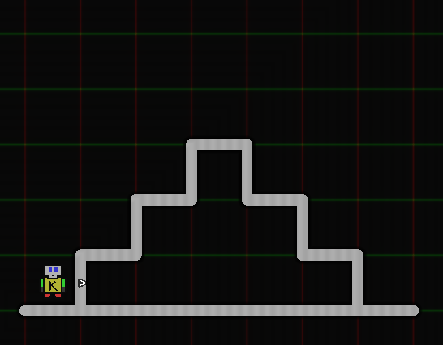
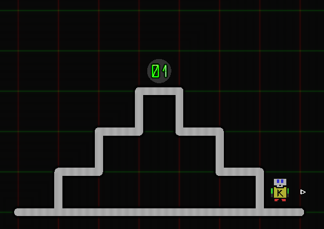
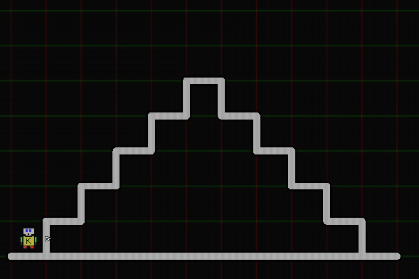

# Karel.js The Robot
# Stair Climber  

Consider the following world.

Write a program as follows:
1. karel climbs the 'stairs'
2. karel places a beeper at the top
3. karel climbs down the other side

such that the world finishes in this state:

The solution you make should also work for the following world, or stairs of any given size.

### Tips:
- Break the problem down into smaller parts.
	- Solve the smaller parts one at a time, and combine the smaller solutions into a bigger solution.

- How can karel climb a single step?
- How does karel know when he is doen climbing steps?
- How different is climbing down the stairs than climbing up?
- What construct needs to be used to get Karel to repeat some task?
		
- Be sure to **give karel a beeper** in his pockets before sending him on his way.
